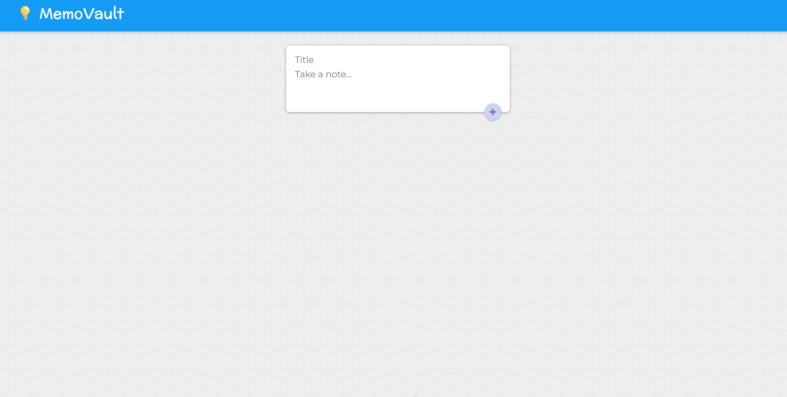
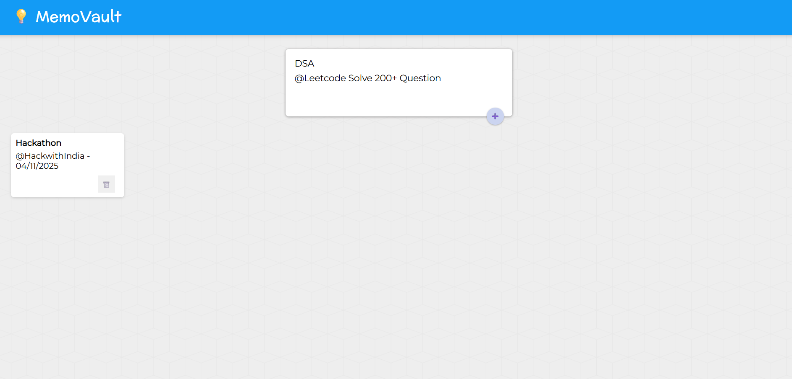

# 🧠 MemoWallet
## 🪙 Decentralised Notes Keeper on the Internet Computer (ICP)

MemoWallet is a blockchain-based notes application built on the **Internet Computer (ICP)**.  
It lets users **create, store, and delete notes** securely on-chain.  
Backend is in **Motoko**; frontend uses **React**.

---

## ✨ Features
- Create and store notes on-chain  
- Delete notes securely  
- Persistent notes via stable variables  
- Async calls with UI refresh  
- Simple, clean interface

---

## 🛠️ Tech Stack
| Technology | Purpose |
|---|---|
| Motoko | Smart-contract backend (canister) |
| React / JavaScript | Frontend UI |
| DFX | ICP local replica & deployment |
| Webpack | Bundling |
| HTML / CSS | Markup & styling |

---

To learn more before you start working with dkeeper, see the following documentation available online:

- [Quick Start](https://sdk.dfinity.org/docs/quickstart/quickstart-intro.html)
- [SDK Developer Tools](https://sdk.dfinity.org/docs/developers-guide/sdk-guide.html)
- [Motoko Programming Language Guide](https://sdk.dfinity.org/docs/language-guide/motoko.html)
- [Motoko Language Quick Reference](https://sdk.dfinity.org/docs/language-guide/language-manual.html)
- [JavaScript API Reference](https://erxue-5aaaa-aaaab-qaagq-cai.raw.ic0.app)

---

## 📂 Project Structure
| Path | Description |
|---|---|
| `src/dkeeper/main.mo` | Motoko backend |
| `src/dkeeper_assets/src/components/` | React components |
| `src/dkeeper_assets/src/index.jsx` | Frontend entry |
| `dfx.json` | Canister configuration |
| `webpack.config.js` | Webpack config |

---
## 📸 Screenshots

| Dashboard | Create Note |
|---|---|
|  |  |

| Notes View | 
|---|
|  |  


---

## 🚀 Running Locally

1. Install dependencies  
   ```bash
   npm install
    ```
2. Start local ICP replica
   ```bash

   dfx start --clean
    ```

3. Deploy canisters
   ```bash

    dfx deploy
    ```
4. Start frontend
   ```bash

      npm start
   ```
5. Open in browser:

👉 [http://localhost:8080/](http://localhost:8080/)


---

### Note on frontend environment variables

If you are hosting frontend code somewhere without using DFX, you may need to make one of the following adjustments to ensure your project does not fetch the root key in production:

- set`NODE_ENV` to `production` if you are using Webpack
- use your own preferred method to replace `process.env.NODE_ENV` in the autogenerated declarations
- Write your own `createActor` constructor

